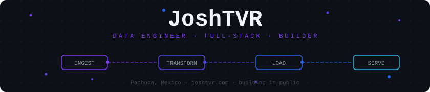
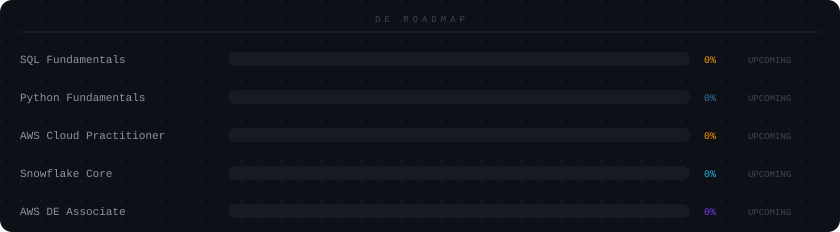

<div align="center">



<br/>



<br/>

[](https://joshtvr.com)
[](https://linkedin.com/in/joshtvr)
[](mailto:joshtvr4@gmail.com)

</div>

---

## `$ python josh.py`

```python
josh = {
    "name":       "Joshua Hernandez",
    "alias":      "JoshTVR",
    "location":   "Pachuca, Hidalgo, Mexico",
    "degree":     "B.Eng. Virtual Environments & Digital Business (UTT, 2026)",
    "working":    "Torturama @ Vortex Editorial - game dev internship",
    "open_to":    "Junior Data Engineer · ETL Developer · Data Analyst",
    "background": ["VR Development", "3D Art", "Full-Stack (Next.js + Supabase)"],
}
```

---

## Stack

<div align="center">

**Data Engineering**

[](https://python.org)
[](https://postgresql.org)
[](https://aws.amazon.com)
[](https://git-scm.com)

**Web & Backend**

[](https://nextjs.org)
[](https://typescriptlang.org)
[](https://supabase.com)

**Background**

[](https://unity.com)
[](https://blender.org)
[](https://figma.com)

</div>

---

## Projects

**`01`** &nbsp; [**joshtvr.com pipeline**](https://joshtvr.com) &nbsp;·&nbsp; `Next.js` `Supabase` `PostgreSQL` `REST APIs`  
Automated content pipeline — pulls from DB, generates social cards with Satori, and publishes to 4 platforms daily. Runs unattended via cron.

<br/>

**`02`** &nbsp; **BI Pipeline** &nbsp;·&nbsp; `SQL Server` `SSIS` `Power BI`  
Data warehouse with Kimball dimensional modeling. Star schema design, ETL with SSIS, dashboards in Power BI.

<br/>

**`03`** &nbsp; [**data-engineering-journey**](https://github.com/JoshTVR/data-engineering-journey) &nbsp;·&nbsp; `Python` `SQL` `AWS`  
Learning data engineering in public. One commit per consolidated concept. Full roadmap toward AWS Data Engineer Associate + SnowPro Core.

---

<div align="center">



</div>

---

## Roadmap

<div align="center">



</div>